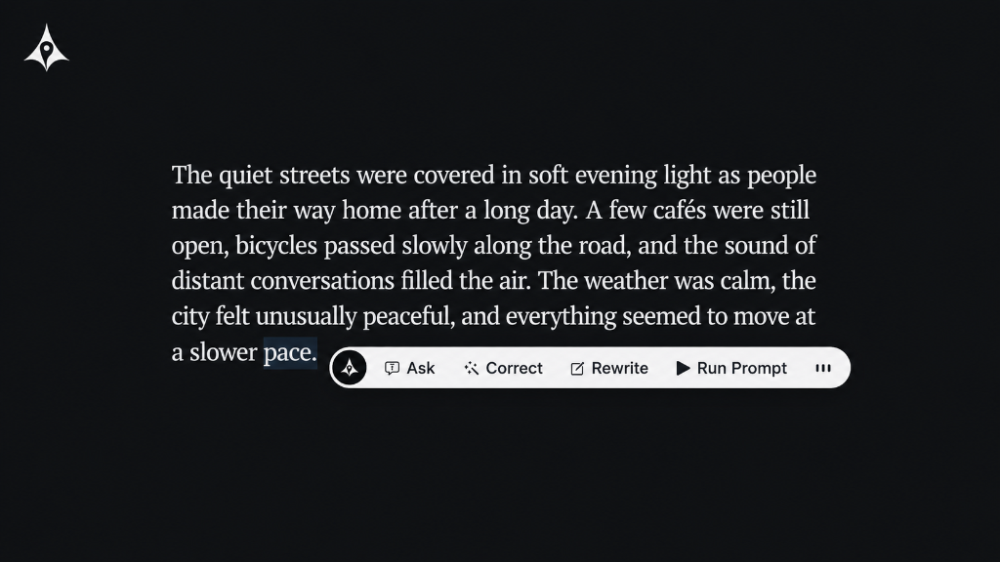
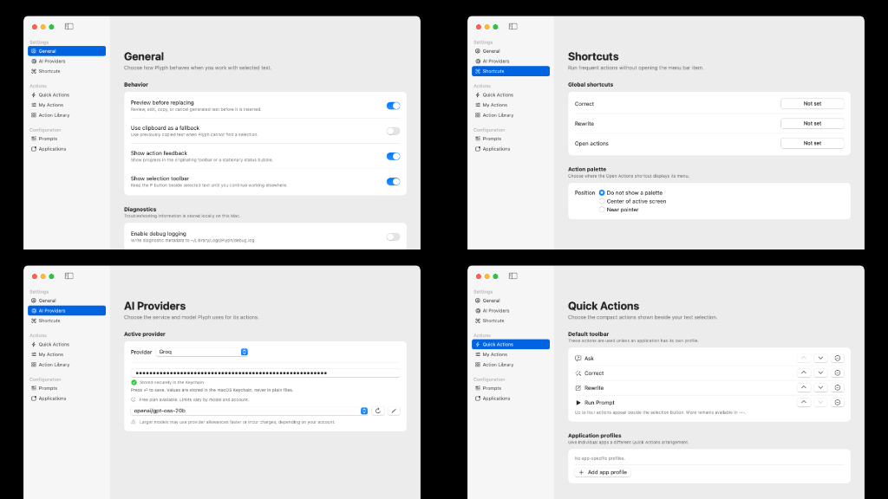
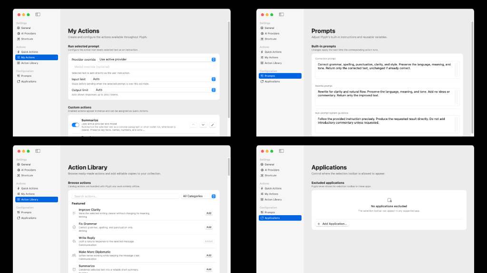

<p align="center">
  
</p>

<h1 align="center">Plyph for macOS</h1>

<p align="center">
  AI actions for selected text on macOS.
  <br>
  Correct, rewrite, translate, summarize, or run custom prompts using the AI provider you choose.
</p>

<p align="center">
  
  
  
  
</p>

<p align="center">
  <a href="#preview">Preview</a> ·
  <a href="#features">Features</a> ·
  <a href="#getting-started">Getting started</a> ·
  <a href="#providers">Providers</a> ·
  <a href="#build-from-source">Build</a>
</p>

---

## Preview

<p align="center">
  
</p>

### Settings

<p align="center">
  
</p>

<p align="center">
  
</p>

## How Plyph works

Select text in Safari, Chrome, Firefox, VS Code, Notes, or another macOS app. Open Plyph to correct, rewrite, translate, summarize, change the tone, or run a custom action. The result can be placed directly back into the original selection.

Plyph stays out of the way until you need it.

## Features

- **Works where you type** — transform selected text in native macOS apps and browser webpages without moving it into a separate AI app.
- **Contextual selection button** — an optional floating button appears beside selected text for immediate access to your actions.
- **Replace in place** — generated text can replace the original selection directly.
- **Review when you want it** — preview the result before replacing, or enable a faster direct-replacement workflow.
- **Bring your own AI** — use Ollama locally or connect Groq, Gemini, OpenAI, OpenRouter, Cerebras, Cloudflare Workers AI, or Vercel AI Gateway.
- **Unlimited custom actions** — build reusable actions for translation, tone changes, summaries, replies, coding tasks, or your own workflows.
- **Per-action models** — assign different providers, models, and limits to different actions.
- **Global shortcuts** — run common actions without touching the mouse.
- **Private credentials** — API credentials are stored in macOS Keychain.

## Getting started

> [!IMPORTANT]
> **Opening Plyph for the first time**
> Plyph is currently an unsigned application. macOS Gatekeeper will block it from opening if you simply double-click it.
> To open it: drag the app into your **Applications** folder, **Right-Click** (or Control-click) on Plyph, and select **Open** from the context menu. Click **Open** again in the security dialog to confirm. You only need to do this once.

1. Download the latest `Plyph.dmg` from the [Releases](https://github.com/ubaimutl/Plyph-Macos/releases) page.
2. Install Plyph and open it using the Right-Click method described above.
3. Grant Accessibility access when macOS asks for it.
4. Open **Settings** from the Plyph menu-bar icon.
5. Select a provider and configure its model and credential.
6. Select text in Safari, Firefox, Chrome, VS Code, a text editor, or another accessible application.
7. Open the action palette from the floating button or a configured shortcut.
8. Review the result, then choose **Replace**, **Copy**, or **Cancel**.

### Included actions

| Action                | Purpose                                                                          |
| --------------------- | -------------------------------------------------------------------------------- |
| Correct selected text | Fix grammar, spelling, punctuation, clarity, and style while preserving meaning. |
| Rewrite selected text | Improve clarity and natural flow without adding new ideas.                       |
| Run selected prompt   | Treat the selected text as an instruction.                                       |
| Summarize             | Produce a concise paragraph or short bullet list while preserving key facts.     |
| Translate             | Translate into the language configured in Settings.                              |
| Adjust tone           | Rewrite using the tone configured in Settings.                                   |

## Providers

Plyph communicates directly with the provider you configure—there is no Plyph-hosted relay.

| Provider              | Connection                                    |
| --------------------- | --------------------------------------------- |
| Ollama                | Local server; no provider credential required |
| Groq                  | API key                                       |
| Cloudflare Workers AI | Account ID and API token                      |
| Google Gemini         | API key                                       |
| OpenRouter            | API key                                       |
| Cerebras              | API key                                       |
| OpenAI                | API key                                       |
| Vercel AI Gateway     | API key                                       |

Provider endpoints, model names, account identifiers, and token limits are configurable where supported. Review your chosen provider's terms and retention policy before processing confidential text.

## Requirements

- macOS 13 Ventura or newer
- Xcode 16 or newer when building from source
- Accessibility permission for selection access and text replacement
- A configured AI provider, or a local Ollama server

## Build from source

Clone the repository, open `Plyph.xcodeproj` in Xcode, or build the unsigned application from Terminal:

```sh
xcodebuild \
  -project Plyph.xcodeproj \
  -scheme Plyph \
  -configuration Release \
  -destination 'platform=macOS' \
  CODE_SIGNING_ALLOWED=NO build
```

Xcode places the result in its DerivedData directory unless you provide a custom derived-data path. The GitHub Actions workflow also builds and tests the application on macOS and produces unsigned DMG and ZIP artifacts after a successful run.

## Accessibility and privacy

Plyph first asks macOS Accessibility APIs for the selected text and replaces it directly when the target application supports the standard attributes. For applications that do not expose selections this way, an optional simulated Copy/Paste fallback is available.

The fallback snapshots the current pasteboard, waits for an actual clipboard change, and restores the previous contents when possible. Accessibility support still varies across browsers, secure fields, remote desktops, sandboxed applications, and custom text editors.

Selected text is sent only when you invoke an action, and it is sent directly to the configured provider. Normal preferences use `UserDefaults`; credentials use macOS Keychain.

## License

Plyph is **source available** under the [PolyForm Noncommercial License 1.0.0](LICENSE).

You may use, study, modify, and redistribute Plyph for purposes permitted by that license. Commercial use, resale, paid redistribution, or offering Plyph as part of a commercial product or service requires separate written permission from the copyright holder.

Copyright and required notices must be preserved. The Plyph name, logo, and branding are not licensed for derivative products or forks.
