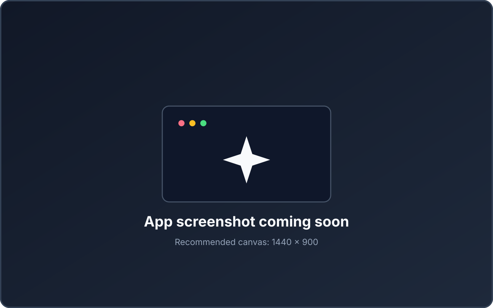

<p align="center">
  
</p>

<h1 align="center">PromptPaste for macOS</h1>

<p align="center">
  Select text anywhere on your Mac. Run an AI action. Replace it in place.
  <br>
  No copy-pasting into chat apps. No locked-in AI provider.
</p>

<p align="center">
  
  
  
  
</p>

<p align="center">
  <a href="#preview">Preview</a> ·
  <a href="#features">Features</a> ·
  <a href="#getting-started">Getting started</a> ·
  <a href="#providers">Providers</a> ·
  <a href="#build-from-source">Build</a>
</p>

---

## Preview

<p align="center">
  
</p>

<p align="center"><em>A polished application screenshot will be added here.</em></p>

### Demo video

<p align="center">
  
</p>

<p align="center"><em>The walkthrough video will be linked here when it is ready.</em></p>

## AI actions where you actually type

PromptPaste turns selected text into an actionable surface.

Select text in Safari, Chrome, Firefox, VS Code, Notes, or another macOS app and PromptPaste can appear beside the selection. Correct it, rewrite it, translate it, summarize it, change its tone, or run any custom prompt — then replace the original text directly.

There is no separate chat workflow to manage. PromptPaste stays out of the way until you need it.

## Features

- **Works where you type** — transform selected text in native macOS apps and browser webpages without moving it into a separate AI app.
- **Contextual selection button** — an optional floating button appears beside selected text for immediate access to your actions.
- **Replace in place** — generated text can replace the original selection directly.
- **Review when you want it** — preview the result before replacing, or enable a faster direct-replacement workflow.
- **Bring your own AI** — use Ollama locally or connect Groq, Gemini, OpenAI, OpenRouter, Cerebras, Cloudflare Workers AI, or Vercel AI Gateway.
- **Unlimited custom actions** — build reusable actions for translation, tone changes, summaries, replies, coding tasks, or your own workflows.
- **Per-action models** — assign different providers, models, and limits to different actions.
- **Global shortcuts** — run common actions without touching the mouse.
- **Private credentials** — API credentials are stored in macOS Keychain.

## Getting started

> [!NOTE]
> A packaged release is planned. Until then, PromptPaste can be built from source with Xcode.

1. Build and launch PromptPaste.
2. Grant Accessibility access when macOS asks for it.
3. Open **Settings** from the PromptPaste menu-bar icon.
4. Select a provider and configure its model and credential.
5. Select text in Safari, Firefox, Chrome, VS Code, a text editor, or another accessible application.
6. Open the action palette from the floating button or a configured shortcut.
7. Review the result, then choose **Replace**, **Copy**, or **Cancel**.

### Included actions

| Action                | Purpose                                                                          |
| --------------------- | -------------------------------------------------------------------------------- |
| Correct selected text | Fix grammar, spelling, punctuation, clarity, and style while preserving meaning. |
| Rewrite selected text | Improve clarity and natural flow without adding new ideas.                       |
| Run selected prompt   | Treat the selected text as an instruction.                                       |
| Summarize             | Produce a concise paragraph or short bullet list while preserving key facts.     |
| Translate             | Translate into the language configured in Settings.                              |
| Adjust tone           | Rewrite using the tone configured in Settings.                                   |

## Providers

PromptPaste communicates directly with the provider you configure—there is no PromptPaste-hosted relay.

| Provider              | Connection                                    |
| --------------------- | --------------------------------------------- |
| Ollama                | Local server; no provider credential required |
| Groq                  | API key                                       |
| Cloudflare Workers AI | Account ID and API token                      |
| Google Gemini         | API key                                       |
| OpenRouter            | API key                                       |
| Cerebras              | API key                                       |
| OpenAI                | API key                                       |
| Vercel AI Gateway     | API key                                       |

Provider endpoints, model names, account identifiers, and token limits are configurable where supported. Review your chosen provider's terms and retention policy before processing confidential text.

## Requirements

- macOS 13 Ventura or newer
- Xcode 16 or newer when building from source
- Accessibility permission for selection access and text replacement
- A configured AI provider, or a local Ollama server

## Build from source

Clone the repository, open `PromptPaste.xcodeproj` in Xcode, or build the unsigned application from Terminal:

```sh
xcodebuild \
  -project PromptPaste.xcodeproj \
  -scheme PromptPaste \
  -configuration Release \
  -destination 'platform=macOS' \
  CODE_SIGNING_ALLOWED=NO build
```

Xcode places the result in its DerivedData directory unless you provide a custom derived-data path. The GitHub Actions workflow also builds and tests the application on macOS and produces an unsigned ZIP artifact after a successful run.

## Accessibility and privacy

PromptPaste first asks macOS Accessibility APIs for the selected text and replaces it directly when the target application supports the standard attributes. For applications that do not expose selections this way, an optional simulated Copy/Paste fallback is available.

The fallback snapshots the current pasteboard, waits for an actual clipboard change, and restores the previous contents when possible. Accessibility support still varies across browsers, secure fields, remote desktops, sandboxed applications, and custom text editors.

Selected text is sent only when you invoke an action, and it is sent directly to the configured provider. Normal preferences use `UserDefaults`; credentials use macOS Keychain.

## Project status

PromptPaste is currently pre-release. Packaging, signing, final screenshots, and a demonstration video will be prepared for a future release.

## License

PromptPaste is distributed under the [GNU General Public License, version 3 or later](LICENSE).
